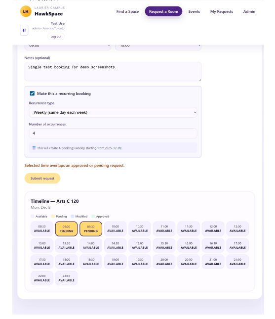
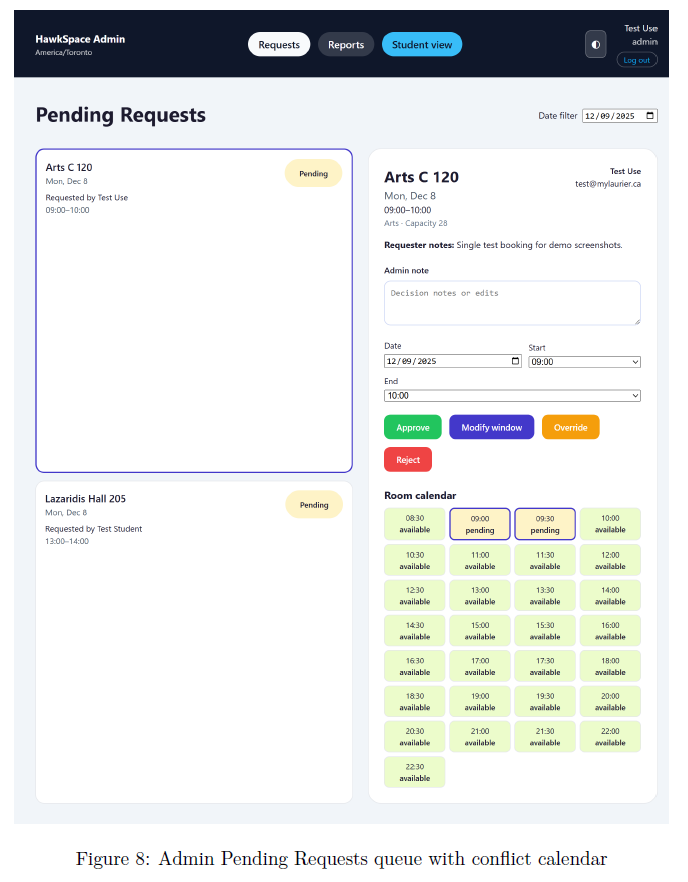

# 🦅 HawkSpace — Laurier Club Room Booking System

> A real-time room reservation platform built for Wilfrid Laurier University student clubs and campus administrators.

HawkSpace replaces the slow, email-based room booking process with a centralized, role-based web application where students can request rooms and admins can approve, override, and report on usage — all in real time.

---

## 🚀 The Problem

At Laurier, room bookings for clubs were handled manually through a single administrator via email. This created:

- Weeks-long delays
- Miscommunication
- Double bookings
- No transparency for clubs
- No reporting or analytics for administrators

HawkSpace solves this with a live booking system inspired by airline-style reservation workflows.

---

## ✨ Features

### 👤 Student / Club Executive Portal
- Search rooms by building, capacity, equipment, and date
- Real-time 30-minute slot availability timeline
- Submit single or recurring booking requests
- View booking status and admin notes
- Cancel entire recurring booking series
- Events dashboard and next-event view
- High-contrast accessibility mode

### 🛠️ Administrator Portal
- Pending and modified request dashboard
- Approve, reject, modify, or override bookings
- Full audit trail of admin actions
- Enforce booking rules (max slot window)
- Monthly room utilization reports with CSV export
- Real-time calendar conflict view
##  Recurring Booking & Slot Timeline

---

##  Admin Pending Requests & Conflict Calendar

---

---

## 🧠 System Architecture

HawkSpace uses a client-cloud architecture built with React and Firebase.

React (Vite) SPA → Firebase Authentication → Cloud Firestore → Real-time listeners

Key design choices:
- Role-based UI (StudentLayout / AdminLayout)
- Firestore transactions prevent double-booking
- Slot-based model using 30-minute blocks
- Firebase scripts for seeding rooms and creating admins
- 

---

## 🏗️ Tech Stack

| Layer | Technology |
|------|------------|
| Frontend | React + Vite, React Router, Context API |
| Backend / Cloud | Firebase Authentication, Cloud Firestore |
| Admin Tools | Firebase Admin SDK scripts |
| Testing | Firebase Emulator Suite |
| Tooling | Node.js 18+, ESLint |
| Accessibility | High-contrast mode, semantic layout |

---

## 🧩 Software Development Frameworks Used

HawkSpace was developed using modern software engineering practices to ensure the system was delivered reliably and on time.

### Agile Scrum Methodology
- Work organized into **3 structured sprints**
- Clear sprint goals: Foundation → Admin workflow → Advanced features
- Daily collaboration and task tracking through GitHub issues and backlog
- Sprint reviews and retrospectives used to improve workflow each iteration

### Product Backlog & User Stories
- All features were broken into **user stories** (UI, ADM, REP, NOTIF, UX, AUTH)
- Each story had points, priority, and acceptance criteria
- Backlog allowed the team to prioritize core functionality first (MVP) before enhancements

### Iterative Development
- System built incrementally:
  1. Authentication and student flows
  2. Admin approval and policies
  3. Recurring bookings, overrides, reporting, and accessibility

### Version Control & Collaboration
- GitHub used for source control, issue tracking, and pull requests
- Managed cross-platform development (Mac/Windows)
- Structured branching and merging strategy to reduce conflicts

### Continuous Testing
- Firebase Emulator used during development
- Manual testing at the end of each sprint
- Validation of booking conflicts, recurring logic, and admin overrides

These frameworks ensured the project stayed on schedule while maintaining code quality and clear team coordination.

---

## ⚙️ Local Setup Guide

### Clone the Repository

git clone https://github.com/SawaabA/HawkSpace.git
cd web

### Install Dependencies

npm install

### Run the App

npm run dev

Visit: http://localhost:5173

---

## 🔧 Admin & Testing Scripts

Seed rooms into Firestore:
npm run seed-rooms

Create an admin account:
npm run create-admin admin@mylaurier.ca Admin123! "Campus Admin"

Verify users if email verification is delayed:
npm run verify-email user@mylaurier.ca

---

## ⚖️ Ethical & Inclusive Design

- Data minimization — only essential booking information stored
- Role-based access control
- Audit logs for accountability
- Accessibility through high-contrast mode
- Fairness via first-come-first-served timestamp ordering

---

## 📌 Known Limitations / Future Work

- Student self-cancel for single bookings
- Full mobile optimization
- Automated email reminders
- Multi-admin role management
- Laurier SSO integration

---

## 👥 Team

| Role | Name |
|-----|------|
| Product Owner | Sawaab Anas |
| Scrum Master | Efetobore Salubi  |
| Development Team | Manahil Bashir, Asmah Yasin Mohamed, Joleene Ismael, Muqadas Nazif |

---

## 💡 Why HawkSpace Matters

HawkSpace demonstrates:
- Real-time systems with live data synchronization
- Transaction-safe booking logic
- Role-based UI/UX architecture
- Accessibility and ethical software design
- Practical Firebase architecture for production-like systems

