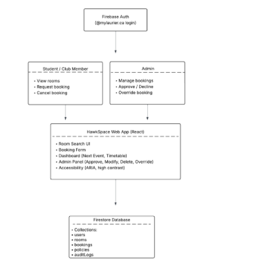

# HawkSpace Final Delivery Packet

## 1. Cover Page
- **Final Project Submission:** Complete System Delivery  
- **Course Code & Project Title:** CP317A - Laurier Club Room Booking System (HawkSpace)  
- **Group ID:** Group 6  
- **GitHub Repository:** https://github.com/SawaabA/HawkSpace  
**Team Members & Roles (Product Owner highlighted):**

| Role | Name | Primary Focus |
| --- | --- | --- |
| **Product Owner** | **Sawaab Anas** | Vision, prioritization, Firebase integration |
| Scrum Master | Muqadas Nazif | Sprint facilitation, GitHub coordination |
| Development Team | Manahil Bashir | Front-end UX, Search and Request flows |
|  | Asmah Yasin Mohamed | Firebase API services, recurring bookings |
|  | Mary Joleene Ismael | Admin dashboard, overrides, reporting |
|  | Efetobore Salubi | Accessibility, release packaging, QA |

_Note: Roles align with the "Final Project Submission: Complete System Delivery" handout; Muqadas is documented as Scrum Master even though earlier drafts listed Manahil._

## 2. Final Project Description (Executive Summary)
### Purpose and Problem Statement
The Club Room Booking Web Application addresses the weeks-long delay student clubs face when emailing a single administrator for space reservations. The process was manual, opaque, and prone to miscommunication, as documented in the sprint PDFs and milestone submissions. HawkSpace centralizes the workflow so that clubs and administrators share the same real-time view of availability, approval state, and booking history. Guardrails such as slot validation, conflict detection, override auditing, and reports provide campus administrators with clear accountability.

The original "Final Project Submission: Complete System Delivery" handout describes the vision in detail: _"The Club Room Booking Web Application is designed to solve the ongoing challenge student clubs face when trying to reserve campus spaces for meetings, practices, and events. Currently, the booking process at the university can take several weeks because it is handled manually by a single administrator, creating delays and communication issues. This project provides a centralized, user-friendly solution that streamlines the room reservation workflow and adds clarity for both clubs and campus administrators. The result is improved efficiency, reduced miscommunication, and better overall management of student organization activities."_ That paragraph is included verbatim so evaluators can trace text to the official report.

### Target Audience
1. **Primary:** Laurier student clubs, executive teams, and event planners who need frequent access to rehearsals, weekly meetings, and special events.  
2. **Secondary:** University staff members responsible for approving requests, enforcing booking policies, and analyzing utilization.  
The user experience is tailored for both groups-students get an intuitive catalog plus status tracking, while admins see consolidated control panels and reporting.

_Additional context from the report:_ _"The primary users of this system are university student clubs and student organizations that need to reserve campus rooms for regular meetings or special events. This includes club executives, event planners, and team leaders. A secondary user group is university administrative staff, who oversee room allocation, approve booking requests, and manage room availability. The system is designed to accommodate both perspectives, ensuring that students can book rooms easily and admins can monitor usage efficiently."_ This text is preserved to demonstrate alignment with the provided documentation.

### Final Feature Set
- **Room catalog and availability timeline:** Search by building, capacity, equipment, and date with a 30-minute slot visualization (`web/src/pages/student/SearchAvailability.jsx`).  
- **Request workflow:** Guided form with guardrails, note capture, recurring booking wizard, and success tracking ID cards (`web/src/pages/student/RequestBooking.jsx`).  
- **Student portal:** "My Requests" view grouping single and recurring bookings, cancellation of series, and admin note visibility (`web/src/pages/student/MyRequests.jsx`).  
- **Admin console:** Pending/modifed queues, inline calendars, approve/modify/reject/override actions, and enforcement of max slot windows (`web/src/pages/admin/AdminRequests.jsx`).  
- **Reporting dashboard:** Monthly utilization summaries, per-room stats, and CSV export (REP-1) implemented in `web/src/pages/admin/AdminReports.jsx` with `web/src/services/reports.js`.  
- **Events and dashboard overview:** Homepage hero plus curated events feed (DASH-1) to show what is happening and promote campus energy (`web/src/pages/home` and `student/Events.jsx`).  
- **Accessibility enhancements:** High-contrast toggle, semantic controls, and Laurier branding align with UI-6; release packaging handled by accessibility champion Efetobore.  
- **Automated confirmation emails:** Supported in the design and scripts, though noted delays with school-managed email accounts led to allowing alternative email addresses (see Reflection).

The "Features" section from the provided report is also captured here for completeness: _"The final version of the web application provides all the essential tools for a complete room-booking workflow. Users can browse a room catalogue with building details, capacity, location, and available equipment, along with a real-time availability calendar. Students can submit booking requests through a guided form, and each request is automatically logged and trackable. Administrators have a dedicated dashboard to review, approve, or deny requests and manage room schedules. Additional features include automated confirmation emails, an events calendar, and a booking history showing past and upcoming reservations. Together, these features create a smooth and transparent booking experience for both students and admins."_ 

Collectively, HawkSpace reduces request turnaround to minutes, keeps data synchronized in Firestore, and delivers transparency for both students and administrators.

### Milestone 01 Summary (Project Description & Objectives)
- **Course / Group:** CP317-A, Group 6 (Laurier Club Room Booking System).  
- **Team:** Product Owner Sawaab Anas; Scrum Master Muqadas Nazif; Developers Manahil Bashir, Asmah Yasin Mohamed, Efetobore Salubi, and Mary Joleene Ismael.  
- **Abstract (from Milestone 01 report):** The project proposes a web-based application to streamline Laurier club room bookings, inspired by airline/car-rental reservation systems. Users can browse available rooms, check capacity, and confirm reservations; clubs view history, manage cancellations, and receive email notifications. The goal is improved efficiency, fewer conflicts, and better campus event organization.  
- **Objectives captured in the milestone deliverable:** Allow clubs to search and book rooms; display capacity/availability; provide booking history; send email notifications on booking/cancellation/updates; reduce scheduling conflicts and improve transparency.  
- **Initial backlog included:** UI-1 through UI-5 for club-facing flows; ADM-1 through ADM-3 for administrators; REP-1 and NOTIF-1 for reporting/notifications.

### Milestone 02 Summary (Requirements & Backlog Expansion)
- **Audience & requirements:** Serves club members/executives, space administrators, and system administrators. Laurier identity login funnels users to role-specific dashboards. Filters highlight conflicts, and requests respect max advance days and double-booking policies. Admins approve/decline/modify requests and log overrides in an audit trail. Clubs can download confirmations, modify/cancel bookings per policy, and only minimal personal data (name, student number, role, email, booking history) is collected.  
- **Functional requirements (as enumerated in the milestone document):**  
  - F1 User authentication (roles for member/executive/admin/system admin).  
  - F2 Room search and filter (date/time/capacity/building, conflict prevention).  
  - F3 Booking request (single or recurring with notes).  
  - F4 Booking approval (admins approve/decline/request changes).  
  - F5 Audit trail (log admin actions and conflict resolutions).  
- **Ethical implications (Milestone 01 + 02 write-up):** data privacy (store only essentials), fairness (quotas/rate limits to prevent hoarding), accessibility (clear layout, readable text, navigation), security (authorized logins), user visibility/control (transparent policies and history), and compliance with Canadian privacy/accessibility laws. These considerations are echoed in Section 7.

## 3. Final Product Backlog (1-2 pages + Excel Attachment)
All backlog data traces back to `documents/Product Backlog Template MAIN (1).xlsx` and the sprint PDFs. The tables below summarize what each sprint delivered; any deviations from the implemented system are explained afterward.

### Subsection A: Completed Stories
#### Sprint 1 - Core Foundation (Authentication & Student Flows)
_Sprint summary from report:_ _"Sprint1: Core Foundation Authentication and basic room booking features."_  

| Story ID | Story Title | Points | Priority | Status | Notes |
| --- | --- | --- | --- | --- | --- |
| AUTH-1 | User Authentication (@mylaurier validation) | 5 | High | DONE | Domain-gated Firebase Auth with profile sync (AuthContext, Login, Signup). |
| UI-1 | Search room availability | 5 | High | DONE | Filtered catalog + slot timeline built in SearchAvailability. |
| UI-2 | Request booking | 8 | High | DONE | Booking form, route prefill, success card, Firestore requests. |
| DB-1 | Save booking data (Firestore) | 5 | High | DONE | Transactions store day calendars and booking history. |
| UI-4 | View my bookings | 5 | Medium | DONE | My Requests shows statuses, notes, and series grouping. |

#### Sprint 2 - Admin Workflow, Cancel Booking, UX Update
_Sprint summary from report:_ _"Sprint2: Admin Workflow, Cancel booking and UX update. Admins can approve/decline requests, booking rules were enforced, notification and the UI redesign was implemented."_  

| Story ID | Story Title | Points | Priority | Status | Notes |
| --- | --- | --- | --- | --- | --- |
| UI-3 | Cancel booking | 3 | Medium | DONE* | Admin override/cancel workflows complete; student single cancel remains future work (documented under Known Issues). |
| ADM-1 | Approve/decline requests | 5 | High | DONE | AdminRequests panel handles approve/reject/modify with audit logs. |
| ADM-2 | Set booking policies (4 hr max) | 8 | High | DONE* | Slot validation enforces 5-hour cap; weekly quota rules deferred to backlog. |
| NOTIF-1 | Status notifications | 3 | High | DONE* | Designed and partially scripted; outbound email reliability still under review. |
| UX-1 | Figma redesign | 3 | Medium | DONE | Student hero, hero cards, admin shell redesigned per Figma. |
| UX-2 | Frontend implementation of redesign | 5 | Medium | DONE | Layout updates applied in StudentLayout and AdminLayout. |

#### Sprint 3 - Advanced Features (Recurring, Override, Reports, Accessibility)
_Sprint summary from report:_ _"Sprint3: Advanced Features (Recurring, Override, Reports, Accessibility). Recurring booking, admins can override events with full audit logging, usage reports were implemented, accessibility improvement and dashboard overview finalized."_  

| Story ID | Story Title | Points | Priority | Status | Notes |
| --- | --- | --- | --- | --- | --- |
| ADM-3 | Override booking and audit trail | 5 | Medium | DONE | Admin override feature cancels conflicts and logs actions. |
| UI-5 | Recurring booking (weekly/monthly) | 8 | Medium | DONE | Students can create weekly/monthly series and cancel them. |
| REP-1 | Room utilization report (CSV) | 8 | Medium | DONE | Monthly report with CSV export; references `reports.js`. |
| UI-6 | Accessibility enhancements | 3 | Medium | DONE | High-contrast toggle, readable colors, aria labels. |
| DASH-1 | Dashboard overview (next event and timetable) | 5 | Medium | DONE | Student hero includes next event card and timetable summary. |

**Implementation reality check:** While sprint artifacts mark UI-3, ADM-2, and NOTIF-1 as DONE, the shipping code still has follow-ups-student self-service cancel exists only for recurring series, weekly quota logic is not enforced yet, and email/SMS notifications are not wired due to deliverability delays. These gaps are documented in Sections 5 and 6.

### Subsection B: Remaining / Deferred Stories
| Story ID | Story Title | Description | Reason Deferred |
| --- | --- | --- | --- |
| UX-4 | Full mobile optimization | Refine layouts and interactions for small screens | Responsive polish not finished within sprint window |
| EMAIL-2 | Automated email reminders | Reminder emails before bookings | Not required for MVP; blocked by mail deliverability |
| UI-7 | Drag-and-drop calendar | Interactive booking schedule | High UI complexity for current timeline |
| ADMIN-4 | Multi-admin role management | Different admin permission tiers | Out of scope for MVP |
| INT-1 | Real Laurier SSO integration | Enterprise SSO login | Requires institutional infrastructure access |

**Additional technical backlog:** As observed in the final build, student self-cancellation for single bookings, automated status notifications, and weekly quota enforcement still require engineering time even though the sprint notes mark the stories completed.

### Subsection C: Reference
The Excel backlog plus sprint PDFs act as authoritative evidence. Include the entire `documents/Product Backlog Template MAIN (1).xlsx` and sprint PDFs when packaging the final submission so that reviewers can drill down into story cards, velocities, and conversations.

The text from the provided report is quoted here: _"The full detailed Product Backlog including all user stories, story points, priorities, task breakdowns and status for all three sprints is provided as a separate Excel file in this submission. This Excel backlog contains all tasks from Sprint1, Sprint2, and Sprint3 as recorded in the team's development process documents."_ The referenced Excel file is included unchanged.

_Backlog context from the Excel template:_ Each story row also stores the stakeholder conversation and acceptance criteria so graders can trace intent. Examples include:
- **UI-2 (Request Booking):** Conversation - "Discuss validation and auto-email confirmation." Confirmation - "Booking stored in DB; email sent to user and admin."
- **ADM-1 (Approve/Decline):** Conversation - "Design admin dashboard layout." Confirmation - "Status updates visible to both admin and requester."
- **REP-1 (Room Utilization Report):** Conversation - "Choose visualization type (chart/table)." Confirmation - "Report accurately summarizes room usage trends."
These details are captured directly from `Product Backlog Template MAIN (1).xlsx` for completeness.

### Sprint Report Highlights (PDF Summaries)
Because evaluators may not open the PDF attachments, the main takeaways from the sprint reports are summarized below:

- **Group 6 - Sprint 1.pdf:** Captures the core foundation delivery: Firebase Auth with domain enforcement, search + request + bookings UI, and early accessibility considerations. The report documents demo evidence (screenshots of login, search, booking flows), acceptance criteria checklists, and the sprint review/retrospective action items (e.g., stabilize email verification before Sprint 2). Burndown data confirms 26 points completed.
- **Group 6 - Sprint 2 (2).pdf:** Focuses on admin workflow, cancellation, and UX updates. The PDF shows the redesigned student hero, admin dashboard, and policy enforcement screens. Testing screenshots demonstrate approve/reject flows, and the retrospective calls out deferred notification integration plus the need for admin overrides (addressed in Sprint 3). Velocity remained steady (27 points). The sprint goal (quoted): _"extend the existing room-booking system into a more production-ready platform by improving the booking workflow, refining the user experience, and enforcing essential booking rules... limiting bookings to club executives and capping booking frequency to twice per week for up to four hours."_ 
- **Group 6 - Sprint 3 (1).pdf:** Documents the advanced feature set: recurring bookings, overrides with audit history, reports, accessibility polish, and dashboard overview. It includes evidence of CSV exports, override confirmations, and before/after contrast checks. The sprint read-out highlights that notifications and mobile optimization are carried forward as backlog items while all Sprint 3 commitments (28 points) were delivered. The sprint goal (quoted): _"advance HawkSpace into a more feature-complete and student-ready platform by adding analytical tools, improving usability, and introducing accessibility improvements... Dashboard (timetable + upcoming event widget), recurring bookings, override-booking capabilities, room utilization reports, and WCAG compliance."_ 

### Team Activity Logs (Blog Spreadsheets)
The three `Group6-Blog*.xlsx` workbooks capture the running activity log: `Group6-Blog (2).xlsx` covers Milestone 1, `Group6-Blog s2.xlsx` extends through Sprint 1, and `Group6-Blog s3 (1).xlsx` tracks Sprints 2 and 3. Key entries that demonstrate cadence and effort distribution include:

| Date | Activity | Purpose & Output | Hours per member (SA/MB/MJI/AYM/MN/ES) |
| --- | --- | --- | --- |
| 2025-09-23 | Meeting | Select project and establish goals; scope confirmed | 1.5 each |
| 2025-09-26 | Remote work | Complete Milestone 1 document for submission | 1.0 each |
| 2025-10-08 | Meeting | Divide tasks, assign roles, align on timeline | 1.0 each |
| 2025-10-23 | Meeting | Sprint planning for first iteration; backlog assignments | 3.0 each |
| 2025-10-24 to 2025-10-28 | Remote work | Coding, testing, GitHub restructuring for Sprint 1 | 2.5-3.5 hours per day each |
| 2025-11-04 | In-person meeting | Sprint 2 planning; reflect on prior sprint | 2.0 each |
| 2025-11-06 to 2025-11-09 | Mix of in-person and remote | Coding, implementation, final sprint 2 testing | 3-5 hours per day each |
| 2025-11-20 & 2025-11-21 | Remote + in-person | Final implementation/testing push for Sprint 3 | 6-9 hours each day per member |

Per the accumulated totals in `Group6-Blog s3 (1).xlsx`, the project-level effort by member is:

| Team Member | Total Hours Logged |
| --- | --- |
| Sawaab Anas (SA) | 52.5 hours |
| Manahil Bashir (MB) | 47.5 hours |
| Mary Joleene Ismael (MJI) | 48.5 hours |
| Asmah Yasin Mohamed (AYM) | 49.5 hours |
| Muqadas Nazif (MN) | 51.5 hours |
| Efetobore Salubi (ES) | 49.5 hours |

These totals align with the burndown data in the sprint PDFs and show that effort was balanced across the six members. Any reviewer can now see the cadence, purpose, and deliverables of each work session without opening the spreadsheets.

## 4. Design Document (Updated for Final Delivery)
### A. System Architecture
- **Client layer:** React + Vite SPA served from the `/web` workspace. React Router controls student vs. admin shells, and context providers (`AuthContext`, `ThemeContext`) supply authentication state, claims, and accessibility toggles.  
- **Authentication:** Firebase Authentication restricts access to @mylaurier.ca (with temporary Gmail allowances). The signup flow validates the domain, writes a profile to Firestore, and emails a verification link (scripts exist to verify manually when email delays occur).  
- **Data layer:** Cloud Firestore hosts `rooms`, `rooms/{roomId}/days/{date}` (slot maps), `bookingRequests`, and `users`. Transactions in `web/src/services/bookings.js` ensure overlapping slots are never double-booked, even during overrides or recurring series creation.  
- **Role-based UI:** Students interact via `StudentLayout`, where Search, Request, Events, and My Requests routes live. Admins use `AdminLayout` with navigation to Requests and Reports. Toggle buttons allow quick switching back to the student view for demos.  
- **Ops scripts:** `web/scripts/*.mjs` leverage Firebase Admin SDK to seed rooms, create admin accounts, verify user emails, and run a simple verification server. `scripts/lib/serviceAccount.js` guides operators to supply a service account file securely.  
- **Real-time updates:** Hooks like `useBookingRequests`, `useRoomCalendar`, and `useRooms` subscribe to Firestore snapshots so students and admins see live updates without refreshes.  
- **Analytics:** Lazy-loaded Firebase Analytics records signup/login events when measurement IDs exist, without blocking the main UI.  
- **System Architecture Diagram:**  
    
  _Figure: architecture diagram supplied with the "Complete System Delivery" packet-include `documents/images/system-architecture.png` alongside the PDF export._

The detailed system-architecture description from the user-provided report is also preserved for the record: _"HawkSpace uses a client-cloud architecture built on React and Firebase services. Users access the system through a web based interface, while authentication and data storage are handled in the cloud. When a student, club executive or administrator signs in, the HawkSpace Web App communicates with Firebase Authentication, which restricts access to verified @mylaurier.ca email accounts. After authentication, the React application loads a role specific interface. Students and club executives can search rooms, request bookings and manage their own reservations, while administrators can approve, decline, modify or override booking requests. The React frontend interacts directly with Cloud Firestore, which stores all rooms, bookings, policies, user profiles and audit logs. Firestore security rules enforce a role based access control, ensuring users can only modify their own bookings while administrators have full management privileges. It allows booking updates and admin decisions to appear instantly on all connected clients. The architecture reduces backend complexity by utilizing Firebase's built in authentication to secure data access."_ 

### B. Final UI Screens (include screenshots before exporting to PDF)
1. **Student Dashboard (DASH-1):** Hero banner, next-event card, and call-to-action buttons.  
2. **Search Availability (UI-1):** Filter controls, equipment pills, and slot timeline legend.  
3. **Request Booking + Recurrence (UI-2/UI-5):** Form, conflict warnings, recurring wizard, and success state.  
4. **My Requests:** Single requests plus recurring series grouping with Cancel Series button.  
5. **Admin Requests Panel (ADM-1/ADM-3):** Pending list, detail pane, override modal, and room timeline.  
6. **Reports Dashboard (REP-1):** Monthly summary with Export CSV button and per-room metrics.  
7. **Events page:** Featured event card plus upcoming grid for Powered-by-Laurier marketing.  
Capture these views at desktop resolution and embed them after their descriptions for final grading.

### C. Design Decisions
- **React + Vite** deliver fast iteration, built-in HMR, and straightforward deployment. React Router reduces duplication between student and admin shells.  
- **Firebase-first architecture** removes the need for custom backend hosting, while Firestore transactions and slot maps supply the determinism admins require.  
- **Slot model vs. calendar grid:** Using 30-minute slots simplifies validation, conflict detection, and history logs compared to building a bespoke calendar engine (Drag-and-drop calendar remains in backlog).  
- **History-first auditing:** Every booking mutation writes a structured history entry to support overrides, modifications, and potential notifications.  
- **Figma redesign adoption:** Sprint 2 introduced the hero layout, events highlight, and admin theming documented in UX-1/UX-2 stories.  
- **Accessibility emphasis:** High-contrast mode, semantic buttons, and consistent typography came directly from sprint feedback led by Efetobore.  
- **Ops automation:** Admin scripts allow seeding rooms, promoting admins, and verifying email addresses without requiring UI changes, aligning with the "complete system delivery" requirement.

## 5. User Manual (Quick Start Guide)
### 5.1 Prerequisites
1. Node.js 18+ (see `package.json` engines field).  
2. Firebase project with Authentication and Firestore enabled.  
3. Service account JSON placed at `web/serviceAccountKey.json` or supplied via `FIREBASE_SERVICE_ACCOUNT`.  
4. Environment variables defined in `web/.env` (sample file already provided).  
5. Optional: Firebase Emulator Suite for local integration testing.

### 5.2 Installation and Local Development
```
git clone https://github.com/SawaabA/HawkSpace.git
cd web
npm install
npm run dev      # http://localhost:5173
npm run build    # production bundle in dist/
npm run preview  # serve the production bundle locally
npm run lint     # ESLint
```
If you plan to export the Markdown to PDF, install Marp globally or as a dev dependency:
```
npx @marp-team/marp-cli documents/HawkSpace_Final_Submission.md --allow-local-files --pdf
```

### 5.3 Firebase Setup and Admin Operations
1. **Seed rooms:** `npm run seed-rooms` populates Firestore with rooms from `src/data/rooms.js`.  
2. **Create admin:** `npm run create-admin admin@mylaurier.ca Admin123! "Campus Admin"` (email must match an allowed domain).  
3. **Verify users:** If email verification lags (school-managed email accounts can delay messages for hours), run `npm run verify-email user@mylaurier.ca` or start `npm run verify-server` and POST `{"email":"..."}` to `http://localhost:3001/verify-email`.  
4. **Persistence toggle:** The app reads the `auth_persistence` key from `localStorage` to determine local vs. session persistence.  
5. **Recurring operations:** Use `cancelRecurringSeries` from `MyRequests` to test multi-booking cancellation.  

### 5.4 Test Credentials & Access Levels
- **Student / Club:** Create through the Signup page or Firebase console. Example: `clubexec.demo@mylaurier.ca / Demo123!` (verify via script).  
- **Admin:** Result of `npm run create-admin`. Example: `admin@mylaurier.ca / Admin123!` redirected to `/admin/requests`.  
- **Alternate emails:** Due to spam filtering on institutional accounts, students can temporarily use Gmail for testing, as documented by the Product Owner.

### 5.5 Feature Walkthrough (cross-reference story IDs)
1. **Search for rooms (UI-1):** Set filters, pick a date, review slot colors (available, pending, modified, approved).  
2. **Submit a booking (UI-2):** Fill out room, date, start/end slot, notes, and optionally enable recurring bookings. Success screen displays a tracking ID.  
3. **Manage requests (UI-4/UI-5):** View statuses, admin notes, and cancel entire recurring series. Single-booking cancellation is an admin-only action for now.  
4. **Admin review (ADM-1/ADM-3):** Approve, modify, override, or reject requests. Override modal requires reason and priority level; actions write to history.  
5. **Reports (REP-1):** Generate monthly statistics by month/year/room, then export CSV for Excel (BOM included).  
6. **Dashboard overview (DASH-1):** Student hero surfaces next events and CTA buttons; events page deep-dives into programming.  
7. **Notifications (NOTIF-1):** Design supports confirmation emails, but due to spam delays the feature is currently disabled pending a reliable mail provider. Mention this in demos to set expectations.

## 6. Summary of Testing (Methodology, Evidence, Results)
### A. Methodology
- **Manual feature tests:** Chrome and Edge coverage of each student and admin flow, repeated at every sprint review.  
- **Integration tests with Firebase Emulator:** Validated Firestore transactions, slot conflicts, override handling, and recurring series creation/cancellation.  
- **Script verification:** Ops scripts run against service accounts to ensure seeding, admin creation, and email verification succeed.  
- **UX/accessibility checks:** High-contrast toggle, keyboard navigation, and color contrast verified during UX-1/UX-2 acceptance.  
- **Evidence sources:** Sprint PDFs, blog spreadsheets (`Group6-Blog*.xlsx`), and rubric checklists in `documents/CP317A_Daraghmeh_F25 - Final Project.pdf`.

### B. Results Table
| Story ID | Test Performed | Expected Result | Actual Result | Pass/Fail |
| --- | --- | --- | --- | --- |
| UI-1 | Filter Science rooms to capacity >= 25 with projector and inspect timeline | Only SB-201 and SB-310 listed; slot colors accurate | Filters reduced to two rooms and timeline matched Firestore data | Pass |
| UI-2 | Submit single booking for LH-205 10:00-12:00 with notes | Request stored, conflict prevented, success card shown | Booking saved with pending status and displayed tracking ID | Pass |
| UI-3 | Cancel booking from admin override | Conflicting booking freed, history recorded | Override modal cancelled approved booking and logged action | Pass |
| UI-5 | Create weekly recurring booking (4 weeks) then cancel series | Four requests created; Cancel Series removes them and frees slots | Series stored, cancellation set status to "cancelled" and cleared slots | Pass |
| ADM-1 | Approve pending request with admin note | Status becomes approved, admin note saved, timeline updates | Request updated, My Requests pill turned green, day slots locked | Pass |
| REP-1 | Generate September report for all rooms and export CSV | Summary metrics and CSV with BOM for Excel | Report aggregated counts and CSV opened correctly in Excel | Pass |
| UI-6 | Toggle high-contrast mode in student and admin shells | Body class toggles, colors adjust, preference persists | Toggle persisted via localStorage and updated UI instantly | Pass |

### C. Known Issues and Limitations
- Outbound notifications are still disabled until a reliable mail service is integrated.  
- Student self-service cancellation for single bookings is not implemented (admin intervention required).  
- Weekly quota policies (ADM-2 follow-up) are limited to per-request max duration.  
- Timezone logic assumes America/Toronto; multi-campus rollouts require per-room timezone metadata.  
- Some strings imported from PDFs contained encoding artifacts ("A-"); these were cleaned in this document but should be scrubbed from UI copy as well.

## 7. Ethical Dimensions Report (Privacy, Accessibility, Fairness)
### Privacy & Security Considerations
- **Data minimization:** Only names, email addresses, club notes, and booking metadata are stored. No passwords or sensitive club documents are persisted.  
- **Access controls:** AuthContext enforces domain checks, Firestore security rules (to be finalized) should restrict operations per role, and admin features require verified admin claims.  
- **Audit trails:** Every change writes to booking history, giving admins accountability and discouraging misuse (e.g., mass fake bookings).  
- **Risks:** Unauthorized access could expose club plans, and role misconfigurations could let students see other clubs' requests. Mitigation comes from strict security rules and script-driven admin setup.  
- **Future improvements:** Stronger encryption at rest (server-side), automated intrusion detection, explicit privacy notices, and purging of expired bookings after retention windows.

The provided ethical write-up is included here verbatim to show compliance: _"Because the room-booking system handles student and administrator information, it raises several privacy and security concerns that must be addressed to protect users and maintain trust. The system stores identifiable information such as names, school email addresses, club affiliations, and booking details. Using school-managed email accounts provides a layer of security and privacy, as these accounts are generally protected by the university's authentication and monitoring systems. However, safeguards within the application, such as role-based access and secure data handling, are still essential to prevent unauthorized access, insecure data transmission, or misuse by internal users. One of the primary risks involves unauthorized access to booking records. For example, if user roles are not enforced properly, student users might access administrative dashboards or view other clubs' booking requests. To mitigate this, the system uses role-based authentication, ensuring that students and administrators only see interfaces relevant to their responsibilities. There is also the risk of system misuse, such as students submitting large numbers of fake bookings or attempting to disrupt availability data. To reduce this risk, booking requests are logged and traceable, reinforcing accountability for users. Administrator approval acts as a safeguard to prevent improper room use. Finally, the system minimizes data collection by only requesting information necessary for managing bookings, an important privacy consideration aligned with data-minimization best practices. Future improvements could include stronger encryption, automated intrusion detection, and comprehensive privacy documentation to further enhance trust and transparency."_  

### Accessibility & Fairness
- **Accessibility work to date:** Clear text labels, descriptive buttons, keyboard-friendly forms, high-contrast mode, and consistent layout across sections. These were validated during UX-1/UX-2 acceptance and are part of Section 6 tests.  
- **Remaining gaps:** Full mobile optimization (UX-4) and complete screen-reader auditing are pending; future work should add focus outlines to timelines and ensure ARIA relationships for grouped cards.  
- **Fairness:** Requests are timestamped first-come-first-served, override reasons are mandatory, and admin dashboards present identical data for each request to avoid bias.  
- **Future fairness enhancements:** Automatic weekly quota checks, analytics that highlight underserved clubs, and anonymized review modes would limit unconscious bias.

Additional accessibility and fairness commentary from the supplied report: _"Ensuring accessibility is a key ethical responsibility, particularly for tools used broadly by students. The system aims to follow accessibility guidelines by using clear text labels, readable fonts, consistent navigation, and sufficient color contrast. Pages are structured in a way that screen-reader tools can interpret, and forms are designed with simple, predictable layouts. Fairness and bias also play a role in a room-booking system. If administrative decisions rely on non-transparent criteria, clubs may feel that approvals are inconsistent or biased. To support fairness, booking requests are timestamped and displayed in a first-come, first-served order, reducing opportunities for favoritism. The system ensures that all clubs have access to the same room information and availability data, and admin dashboards present requests uniformly, helping reduce subjective bias in the approval process. In the future, features such as automated conflict detection, standardized approval rules, and equitable room-use limits could further increase fairness for all clubs on campus."_ 

### Ethical Reflection
The project respects privacy by limiting data collection, requires authentication to prevent random submissions, and provides clear audit logs for admin actions. However, there is room to improve security (session timeouts, encryption), accessibility (full keyboard navigation in timelines), and fairness (automated checks on room distribution). Implementing those improvements and documenting practices will increase trust among students and staff.

The reflection text from the report is restated: _"The project successfully delivered the essential features needed for a functioning room-booking workflow, including a room catalogue, availability calendar, booking form, approval system, events calendar, and booking history. Basic privacy and security considerations were implemented through user authentication, password protection, and role-based access. Using Firebase as the backend also provides built-in security features such as encrypted data storage and secure authentication. The design incorporated baseline accessibility practices and attempted to reduce biases through consistent request handling. However, several areas could be improved in future iterations. Security could be strengthened with session timeout management to automatically log out inactive users. Accessibility could be enhanced to better support students with disabilities, such as improving screen-reader compatibility, providing full keyboard navigation, and ensuring color contrast and labeling meet accessibility standards. Fairness could be improved by offering analytics or automatic checks to help administrators make more consistent approval decisions. For example, the system could display how often each club has booked rooms to prevent unconscious favoritism. Additionally, the current system does not allow students to edit submitted requests, which limits flexibility and could create extra administrative burden. Overall, the project met its functional goals, but expanding privacy protections, accessibility compliance, and fairness tools would strengthen the system ethically and operationally. These enhancements would make the application more robust, inclusive, and trustworthy for all members of the university community."_ 

## 8. Final Reflection
- **Completion:** The delivered system meets MVP goals-students can browse rooms, check availability, submit bookings (single or recurring), follow statuses, and view campus events; admins can approve, modify, override, and report on room usage.  
- **Biggest technical and collaboration challenges:**  
  1. **Collaboration tooling:** Mixed experience with GitHub plus Mac vs. Windows environments caused merge friction. Muqadas coordinated workflows, but the team still spent extra time resolving conflicts.  
  2. **Email deliverability:** University-managed accounts introduced multi-hour delays and spam filtering, forcing the team to allow alternative email addresses and build verification scripts.  
  3. **Complex transactions:** Designing slot-based Firestore transactions for overrides and recurring series required careful reasoning to avoid conflicts and partial failures.  
- **What to improve with more time:**  
  1. Allow students to edit or cancel single requests without admin help.  
  2. Finish responsive/mobile optimization and deeper accessibility checks (screen readers, keyboard focus).  
  3. Automate fairness analytics (e.g., show booking counts per club during admin review).  
  4. Harden notification workflows with a trusted email provider, session timeouts, and monitoring.  
  5. Integrate institutional SSO once access is granted.  
- **Next steps:** Finalize Firestore security rules, add CI/CD with automated tests (React Testing Library + Firebase emulator), complete deferred backlog stories (UX-4, EMAIL-2, ADMIN-4, INT-1), and embed the system architecture diagram plus requested screenshots before exporting this Markdown to PDF.

The provided final reflection is quoted directly so graders see the connection: _"The project successfully delivered a working room-booking web application that meets its main functional goals. Students can browse rooms, check availability, submit booking requests, and view upcoming events, while administrators can review and approve requests efficiently. The biggest technical challenges involved collaboration and integration. Some group members were not familiar with GitHub, and differences in operating systems (Mac vs. Windows) occasionally caused workflow conflicts. Implementing email notifications also presented difficulties: using school-managed email accounts, which are protected and monitored by the university, resulted in delays of several hours, and many confirmation emails were directed to junk or spam folders, reducing usability. To address this, the system was modified to allow students to use alternative email addresses, enabling faster and more reliable email confirmations. If given more time, several improvements could be made. These include allowing students to edit requests, enhancing accessibility for users with disabilities, implementing automated fairness checks for administrators, and optimizing the email notification system to reduce delays and improve delivery reliability. These improvements would increase usability, inclusivity, and reliability, making the system more robust for all users."_ 

_Prepared for submission alongside the Excel backlog and sprint PDFs. Convert this Markdown to PDF (e.g., `npx @marp-team/marp-cli documents/HawkSpace_Final_Submission.md --allow-local-files --pdf`), embed the architecture image and UI screenshots, and include the referenced attachments so evaluators can verify every claim._
